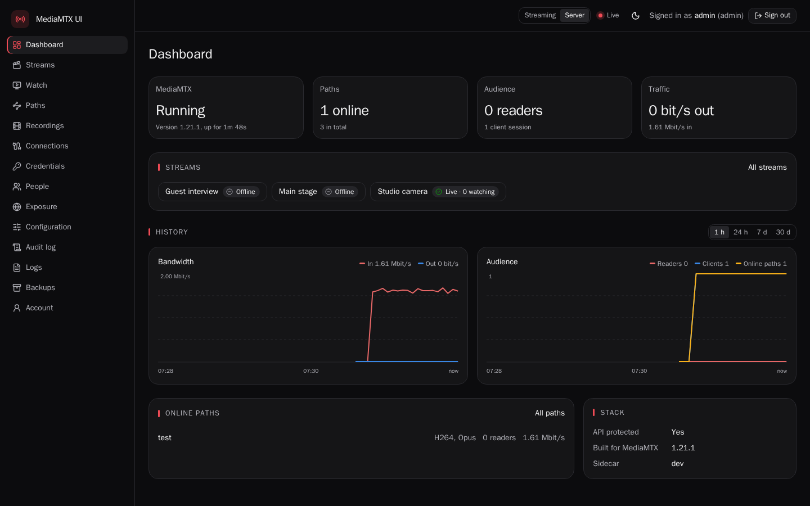
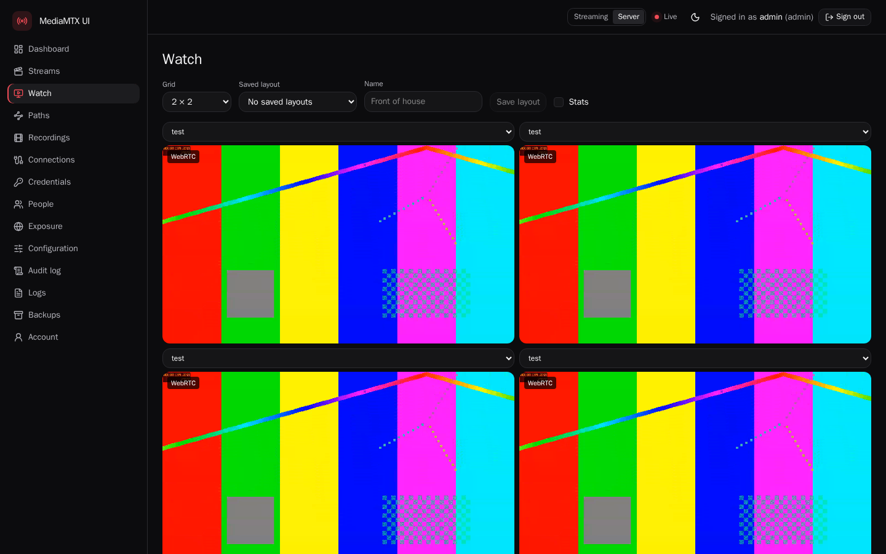
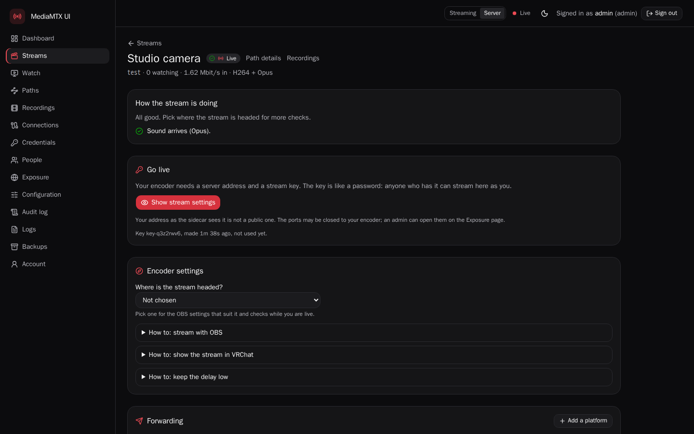
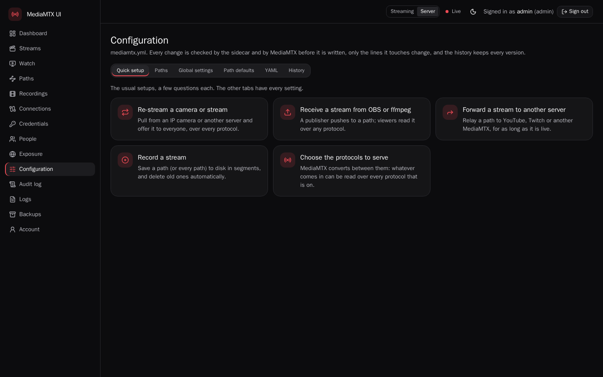
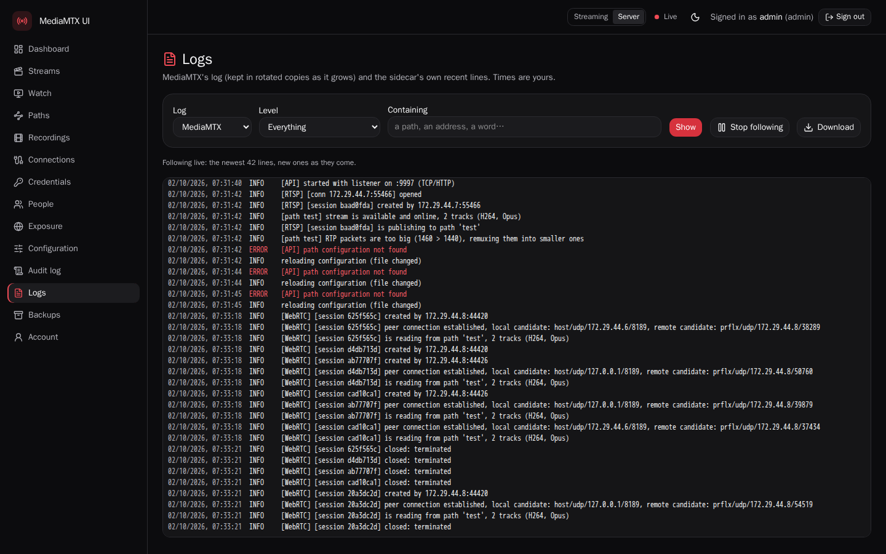

<div align="center">

# MediaMTX UI

**A web UI for [MediaMTX](https://github.com/bluenviron/mediamtx): run your own streaming server, from one Docker Compose file.**

Streams with their own pages and keys, a live view and multi-view, recordings, users and roles, forwarding to other
platforms, holding screens, logs and backups. HTTPS with Let's Encrypt is built in.

[](https://github.com/greatmastix/MediaMTXUI/actions/workflows/ci.yml)
[](https://github.com/greatmastix/MediaMTXUI/actions/workflows/release.yml)
[](LICENSE)



</div>

## Install

You need a Linux host with Docker (with the Compose plugin), and a domain name pointing at it (an A record: see
[Ports](#ports)).

**1. Get the two files** of the latest release

```bash
mkdir mediamtx-ui && cd mediamtx-ui
curl -fsSLO https://github.com/greatmastix/MediaMTXUI/releases/latest/download/compose.yaml
curl -fsSL -o .env https://github.com/greatmastix/MediaMTXUI/releases/latest/download/env.example
```

**2. Set your domain** in `.env` (and an e-mail address for Let's Encrypt, if you like):

```bash
DOMAIN=stream.example.com
ACME_EMAIL=you@example.com
```

**3. Start it**

```bash
docker compose up -d
```

**4. Open `https://stream.example.com`** and create the first admin with the setup token:

```bash
docker compose exec sidecar /mtxui setup-token
```

That's it. The certificate is requested on the first start and renewed by itself. The setup wizard switches on the
protocols you want; then create a stream on the **Streams** page and point your encoder (OBS, ffmpeg, a camera) at
the address and key it shows.

> [!TIP]
> Trying it out? Add `ACME_DIRECTORY=https://acme-staging-v02.api.letsencrypt.org/directory` to `.env` to use
> Let's Encrypt's staging server, which has generous rate limits (browsers will warn about its certificate).
> The staging certificate stays in the state volume, and the sidecar keeps serving it until it is due for renewal,
> weeks later. To switch to the real one, remove the line from `.env`, delete the cached certificate, and start
> again:
>
> ```bash
> docker compose stop sidecar
> docker run --rm -v mediamtx-ui_data-state:/state busybox rm -rf /state/acme
> docker compose up -d
> ```

### Ports

Open these in your firewall or cloud provider's security group:

| Port | Protocol | For |
|---|---|---|
| 80, 443 | TCP | The UI (HTTPS), and Let's Encrypt's check of your domain |
| 1935 | TCP | RTMP: OBS and most encoders |
| 8554 | TCP | RTSP: cameras and players |
| 8890 | UDP | SRT |
| 8189 | UDP | WebRTC: watching in the browser, WHIP encoders |

Only open the stream ports you use. MediaMTX's API, metrics and playback server are never published: the sidecar
answers for them, behind its sign-in.

The ports are published on the host's IPv4 addresses only (`0.0.0.0`), so the domain needs an A record. An AAAA
record alone does not work, and next to an A record it sends IPv6 clients to a closed port first. Publishing on IPv6
(`[::]`) is not supported: the stack's Docker network has no IPv6, so Docker would relay every IPv6 connection to
the containers from the network's gateway, and sign-in limits and address rules could no longer tell those clients
apart.

## Features

- **Streams** with their own page, keys and encoder settings (OBS presets, health checks while you are live), owned by
  streamer accounts that see only their own streams. New streams are public, with a watch link anyone can open;
  the stream's owner, an operator or an admin can make one private.
- **Live view** in the browser over WebRTC, with an HLS fallback, a multi-view grid with saved layouts, and live
  charts of bandwidth and viewers (an hour live, 30 days of history).
- **Recordings** on a timeline per stream: play, download a range as MP4, delete. A storage budget deletes the
  oldest, and a free-space guard stops recording before the disk fills up.
- **Forwarding** to YouTube, Twitch and other servers, and **holding screens** that play while nobody streams (your
  own clip, transcoded in the browser, or a built-in "offline" screen).
- **Guest keys**: let someone stream or watch for a while, without an account.
- **Configuration** of MediaMTX with guided setups and every setting, a raw YAML editor and the full history of every
  change. Every config is validated before MediaMTX sees it, and edits touch only the lines they change.
- **People and roles** (admin, operator, viewer, streamer), invitations by one-time join code, authenticator apps and
  passkeys, "confirm it's you" before admin-level changes, and an **audit log** of everything anyone changed.
- **Logs** of MediaMTX and the UI, live and searchable, and **backups**: encrypted with your passphrase, daily and on
  demand, restorable on a fresh server.
- Runs on **amd64 and ARM** (arm64, armv7: a Raspberry Pi will do).

| | |
|---|---|
|  |  |
|  |  |

## Configuration

`.env.example` lists the settings an install usually needs: where recordings and backups are kept, a recordings
storage budget, the published ports. Every setting of the sidecar is in [docs/config.md](docs/config.md). Set the
others in a `compose.override.yaml` next to `compose.yaml`, not in `compose.yaml` itself, which an upgrade replaces.
Compose reads the override by itself (unless `.env` sets `COMPOSE_FILE`: then add it to that list):

```yaml
services:
  sidecar:
    environment:
      MTXUI_RECORDINGS_MIN_FREE_GB: "4"
      MTXUI_RECORDINGS_CRITICAL_FREE_GB: "1"
```

MediaMTX itself is configured in the UI.

**Behind your own reverse proxy** (Caddy, nginx, Traefik): the sidecar then serves plain HTTP on `127.0.0.1:8080`
and leaves HTTPS to the proxy. See [docs/behind-a-proxy.md](docs/behind-a-proxy.md).

**Recordings on another disk**: set `RECORDINGS_PATH=/srv/recordings` in `.env` (a directory owned by uid 10002).

**Recordings and free space**: whatever the storage budget, the oldest recordings are deleted (never a stream's
newest segment) while the recordings disk has less than 20 GB free. For the default volume, that is the disk Docker
keeps its data on. Below 5 GB free, recording is switched off for every stream until an admin switches it back on,
which takes 20 GB free again. On a small disk (a Raspberry Pi's SD card, a small VPS) lower both limits, as in the
example above; `MTXUI_RECORDINGS_MIN_FREE_GB: "0"` deletes nothing for free space.

## Upgrading

Download the new release's `compose.yaml` (and, the same way, any override from the docs that you use), then
recreate the stack:

```bash
curl -fsSLO https://github.com/greatmastix/MediaMTXUI/releases/latest/download/compose.yaml
docker compose pull && docker compose up -d
```

The database migrates by itself. Each release is built and tested against one MediaMTX version, and its
`compose.yaml` names both images: the sidecar of that release and that MediaMTX. So upgrade by replacing the file,
never one image alone (`docker compose pull` by itself keeps the versions you have). For a particular release
instead of the latest, download from `releases/download/v1.2.3/` instead of `releases/latest/download/`; the
[releases](https://github.com/greatmastix/MediaMTXUI/releases) say what changed.

## Backups

Set a passphrase on the **Backups** page: from then on a backup is made every night (and whenever you press "Back up
now"), encrypted with it. A backup holds people, streams and their keys, the configuration and its history, holding
clips, chart history and the audit log; not the recordings. Download one now and then to keep a copy off the server,
and keep the passphrase somewhere safe: without it, nobody can open a backup.

To restore, on the same or a fresh server: upload the file on the Backups page, enter its passphrase, check what the
restore will change, and restore. The UI restarts with the backup in a few seconds; MediaMTX keeps running.

## Security

- Nothing anonymous: MediaMTX asks the sidecar about every connection (`authMethod: http`), and its open-relay
  defaults never reach the config. Publishing always takes a key. Watching without an account takes one only for a
  private stream: streams are public when they are created, and the stream's owner, an operator or an admin can make
  one private (and public again).
- Both containers run as an unprivileged user on a read-only filesystem with every capability dropped. The sidecar
  holds no host credentials and does not see the Docker socket.
- Secrets are generated on the first start and kept in the state volume; none goes into `.env` or the compose file.
- Passwords are hashed with argon2id; sign-in is rate-limited and locks out guessing; sessions are server-side.
- Optional second factors (authenticator app, passkeys), and a fresh confirmation before admin-level changes.

Found a vulnerability? See [SECURITY.md](SECURITY.md).

**Exposure control** (advanced): stream ports that stay closed until an admin opens them for an address or a while.
It needs a firewall in front of Docker that ufw rules control; see [docs/exposure-control.md](docs/exposure-control.md).

## Troubleshooting

- **No certificate / the browser warns**: `docker compose logs sidecar` says why. Usually the domain does not point at
  this host yet, or ports 80 and 443 are not reachable from the internet. The sidecar retries on the next visit.
- **The encoder cannot connect**: is the stream port open in the firewall, and is the protocol on (Configuration →
  Quick setup → Choose the protocols)? The stream's page says what it sees, and **Logs** shows MediaMTX's side.
- **The browser plays nothing, or only after a while**: WebRTC needs UDP 8189; without it the player falls back to
  HLS, a few seconds behind. Encoders that send B-frames (OBS's x264 default) can only be watched over HLS; the stream
  page says so.
- **Lost a password**: another admin presses **Reset password** on the **People** page and passes on the join code
  it shows, which lets you choose a new password once. Lost the authenticator app: sign in with a recovery code, or
  have another admin press **Reset second factor** there. The only admin cannot get back in after losing the
  password, so keep a second admin account. Restoring a backup does not help (it brings back the same accounts and
  passwords), and starting over with `docker compose down -v` deletes all data, the backups volume included.

## Development

Everything runs in pinned containers: you need bash and Docker. `./dev up` starts a dev stack on `127.0.0.1`,
`./dev ci` runs the checks and `./dev e2e` the end-to-end tests. [CONTRIBUTING.md](CONTRIBUTING.md) has the details.

## License

[MIT](LICENSE). MediaMTX UI is not affiliated with the MediaMTX project; it runs the official
[MediaMTX](https://github.com/bluenviron/mediamtx) image (MIT) alongside its own.
